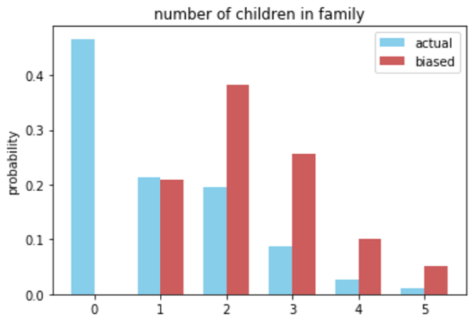

[Think Stats Chapter 3 Exercise 1](http://greenteapress.com/thinkstats2/html/thinkstats2004.html#toc31) (actual vs. biased)

```python
import numpy as np
from collections import Counter
import matplotlib.pyplot as plt

import nsfg

def show_plot(pmf, biased_pmf):
    children = np.array(list(pmf.keys()))
    bar_width = 0.35

    fig, ax = plt.subplots()
    rects1 = ax.bar(children - bar_width/2, [pmf[c] for c in children], bar_width,
                    color='SkyBlue', label='actual')
    rects2 = ax.bar(children + bar_width/2, [biased_pmf[c] for c in children], bar_width,
                    color='IndianRed', label='biased')

    ax.set_ylabel('probability')
    ax.set_title('number of children in family')
    ax.set_xticks(children)
    ax.legend()
    plt.show()

resp = nsfg.ReadFemResp()

counts = Counter(resp.numkdhh)
total = sum(counts.values())
pmf = {children: count / total for children, count in counts.items()}

biased_counts = {children: count * children for children, count in counts.items()}
biased_total = sum(biased_counts.values())
biased_pmf = {children: count / biased_total for children, count in biased_counts.items()}

show_plot(pmf, biased_pmf)
```



```python
mean = 0.0
biased_mean = 0.0
for children, prob in pmf.items():
    mean += children * prob
    biased_mean += children * biased_pmf[children]

(mean, biased_mean)
# (1.0242051550438309, 2.4036791006642821)
```
