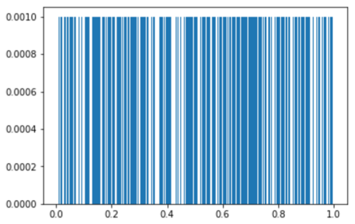
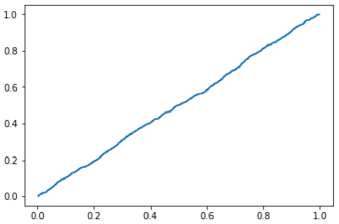

[Think Stats Chapter 4 Exercise 2](http://greenteapress.com/thinkstats2/html/thinkstats2005.html#toc41) (a random distribution)

```python
import numpy as np
from collections import Counter
import matplotlib.pyplot as plt

n = 1000
uniform_random = np.random.random(n)
counts = Counter(uniform_random)
sorted_uniform = sorted(uniform_random)
pmf = [counts[x] / n for x in sorted_uniform]
cdf = [i / n for i in range(1, n + 1)]

# PMF
bar_width = 0.001
plt.bar(sorted_uniform, pmf, bar_width)
plt.show()
```



```python
# CDF
plt.step(sorted_uniform, cdf)
plt.show()
```


